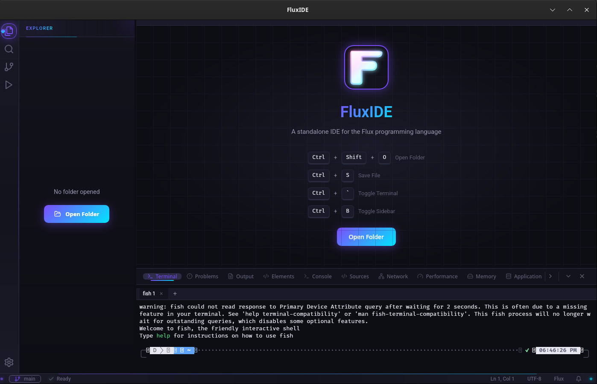

# FluxIDE

A standalone integrated development environment for the [Flux programming language](https://github.com/theticarcher38/Flux).



## Features

- **Monaco Editor** - Full-featured code editor with Flux syntax highlighting
- **Live Preview** - See your compiled Flux output in real-time
- **Integrated Terminal** - Built-in terminal with multiple tabs
- **File Explorer** - Browse and manage your project files
- **Keyboard Shortcuts** - VS Code-like shortcuts for productivity
- **Cross-Platform** - Runs on Linux, Windows, and macOS

## Installation

### Pre-built Binaries

Download the latest release for your platform:

| Platform | Download |
|----------|----------|
| Linux (Universal) | `FluxIDE_x.x.x_amd64.AppImage` |
| Linux (Debian/Ubuntu) | `FluxIDE_x.x.x_amd64.deb` |
| Linux (Fedora/RHEL) | `FluxIDE-x.x.x-1.x86_64.rpm` |
| Windows | `FluxIDE_x.x.x_x64-setup.exe` |
| macOS | `FluxIDE_x.x.x_x64.dmg` |

### Linux AppImage

```bash
chmod +x FluxIDE_x.x.x_amd64.AppImage
./FluxIDE_x.x.x_amd64.AppImage
```

### Debian/Ubuntu

```bash
sudo dpkg -i FluxIDE_x.x.x_amd64.deb
```

### Fedora/RHEL

```bash
sudo rpm -i FluxIDE-x.x.x-1.x86_64.rpm
```

## Quick Start

1. **Open a Folder** - Click "Open Folder" or press `Ctrl+Shift+O`
2. **Create/Open a Flux File** - Files with `.flux` extension get syntax highlighting
3. **Edit and Save** - Press `Ctrl+S` to save
4. **View Preview** - The preview panel shows compiled output automatically
5. **Use Terminal** - Press `Ctrl+\`` to toggle the integrated terminal

## Keyboard Shortcuts

| Shortcut | Action |
|----------|--------|
| `Ctrl+S` | Save file |
| `Ctrl+Shift+O` | Open folder |
| `Ctrl+W` | Close current tab |
| `Ctrl+Tab` | Next tab |
| `Ctrl+Shift+Tab` | Previous tab |
| `Ctrl+B` | Toggle sidebar |
| `Ctrl+\`` | Toggle terminal |

## Documentation

- [Getting Started](docs/getting-started.md)
- [Editor Features](docs/editor.md)
- [Terminal](docs/terminal.md)
- [Preview Panel](docs/preview.md)
- [Keyboard Shortcuts](docs/shortcuts.md)
- [Building from Source](docs/building.md)
- [Contributing](docs/contributing.md)

## Building from Source

### Prerequisites

- [Node.js](https://nodejs.org/) 18+
- [Rust](https://rustup.rs/) 1.70+
- Platform-specific dependencies (see [Building from Source](docs/building.md))

### Build Steps

```bash
# Clone the repository
git clone https://github.com/yourusername/fluxide.git
cd fluxide

# Install dependencies
npm install

# Run in development mode
npm run tauri dev

# Build for production
npm run tauri build
```

## Tech Stack

| Component | Technology |
|-----------|------------|
| Framework | [Tauri v2](https://tauri.app/) |
| Frontend | [React 18](https://react.dev/) + [TypeScript](https://www.typescriptlang.org/) |
| Editor | [Monaco Editor](https://microsoft.github.io/monaco-editor/) |
| Terminal | [xterm.js](https://xtermjs.org/) |
| State | [Zustand](https://zustand-demo.pmnd.rs/) |
| UI | [Lucide Icons](https://lucide.dev/) |

## License

MIT License - see [LICENSE](LICENSE) for details.

## Acknowledgments

- The Flux programming language
- Tauri for the amazing framework
- Monaco Editor for the powerful code editing experience
